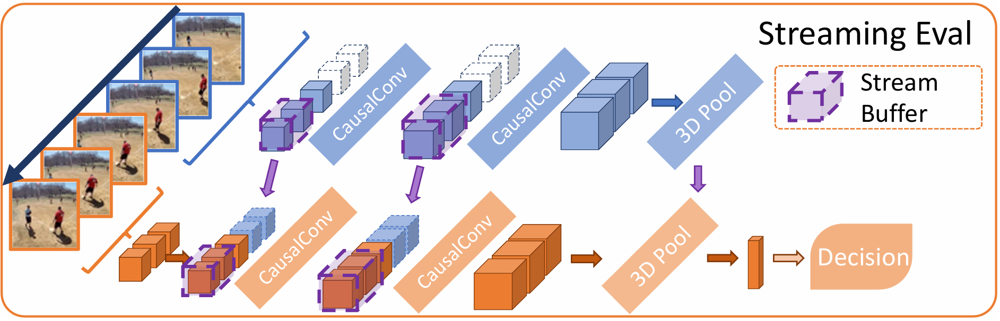

# Exploring_MoviNet

**MoViNet**, short for Mobile Video Network, is an advanced video recognition model specifically optimized for mobile and resource-constrained devices. It leverages cutting-edge techniques such as **Neural Architecture Search (NAS)**, **stream buffering**, and **temporal ensembling** to deliver high accuracy and efficiency in real-time video processing. Designed to handle the unique challenges of video analysis on mobile platforms, MoViNet can process video streams efficiently while maintaining low memory usage, making it suitable for applications ranging from surveillance and healthcare monitoring to sports analytics and smart home systems.

## Strengths of MoViNets
* **High Accuracy:** MoViNets achieve state-of-the-art accuracy on various video recognition benchmarks, demonstrating their ability to effectively extract and learn spatiotemporal features.
* **Memory Efficiency:** Significant reduction in memory usage compared to traditional 3D convolutional networks. Making them suitable for deployment on resource-constrained devices like mobile phones.
* **Online Inference:** Supports online inference, enabling frame-by-frame predictions and efficient processing of streaming video, which is crucial for real-time applications.

## Real-World Applications
* **Surveillance and Security:** Can enhance security by enabling real-time detection of objects, activities, and anomalies in surveillance systems, improving safety in public spaces, buildings, and at borders.
* **Healthcare Monitoring:** Can analyze medical images like X-rays and MRIs to assist healthcare professionals in diagnosing and tracking the spread of diseases like cancer.
* **Sports Analytics:** Sports organizations can use video classification to analyze player performance, tactics, and opponent strategies, leading to improved decision-making and player development.
* **Video Conferencing:** Can enable real-time video analysis in video conferencing applications, optimizing video quality, detecting participants’ emotions, and enhancing the overall conferencing experience.
* **Smart Homes:** Smart home systems use MoViNet to analyze security footage in real-time, detect suspicious activity, and alert homeowners.

Check out my **Analytics Vidhya** article [here](https://www.analyticsvidhya.com/blog/2024/08/exploring-movinets-efficient-mobile-video-recognition/)
